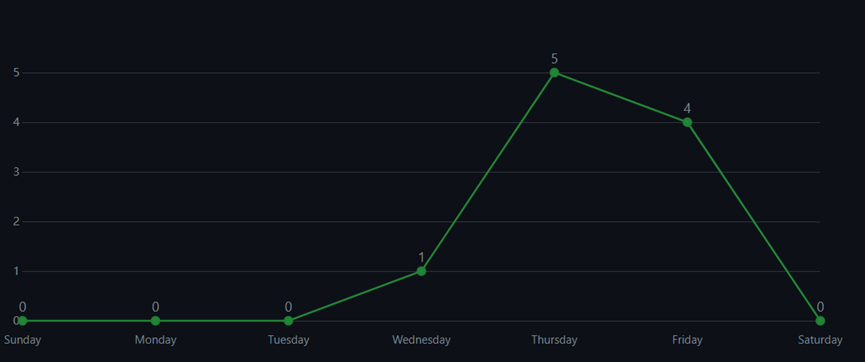

# 金山云知识导入基础编程题
git提交id为G-Raser，本次项目主要结构如下图所示。

1. 第一题  
实现路径：  
src/main/java/Question1/MyStringUtils.java  
测试方法路径：  
src/main/java/Question1/StringUtilsDemo.java
2. 第二题  
   实现路径：  
   src/main/java/Question2/StudentAnno.java  
   src/main/java/Question2/Set2Excel.java
   src/main/java/Question2/Student.java  
   测试方法路径：  
   src/main/java/Question2/PrintInfoDemo.java
3. 第三题  
   实现路径：  
   src/main/java/Question3/MyThread.java  
   测试方法路径：  
   src/main/java/Question3/ThreadDemo.java